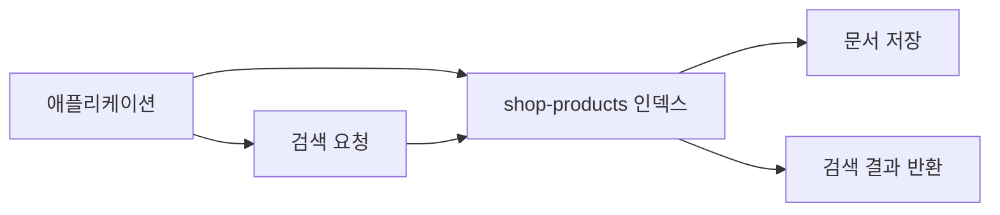

## Elasticsearch 구조 요약

현재 프로젝트의 Elasticsearch는 `shop-products` 인덱스에 상품 검색용 데이터를 저장하는 구조입니다.  
로컬에서는 단일 노드로 실행하므로, 먼저 아래 개념만 이해하면 충분합니다.

### 핵심 개념

| 용어 | 의미 |
| --- | --- |
| 클러스터 | Elasticsearch 전체 묶음 |
| 노드 | Elasticsearch 서버 1대 |
| 인덱스 | 문서를 모아두는 이름 있는 저장소 |
| 샤드 | 인덱스를 나눠 저장하는 조각 |
| 레플리카 | 샤드의 복사본 |
| 문서 | 저장되는 JSON 데이터 1건 |
| 필드 | 문서 안의 각 값(`name`, `price` 같은 값) |

### 현재 프로젝트 기준으로 보면

- 클러스터: 로컬에서 실행 중인 Elasticsearch 한 대
- 노드: 현재 실행 중인 Elasticsearch 서버 1개
- 인덱스: `shop-products`
- 샤드: 인덱스를 나눠서 저장하는 단위
- 레플리카: 샤드를 복사해 둔 데이터
- 문서: 상품 검색용 데이터 1건
- 필드: `id`, `name`, `brand`, `category`, `price`, `updatedAt`

현재 로컬 환경은 보통 이렇게 보면 됩니다.

- 노드: 1개
- 샤드: 인덱스 생성 시 설정한 개수
- 레플리카: 개발 환경에서는 주로 `0`

예시 문서:

```json
{
  "id": 1,
  "name": "나이키 운동화",
  "brand": "NIKE",
  "category": "shoes",
  "price": 129000,
  "updatedAt": "2026-03-13T10:00:00"
}
```

### 데이터가 들어가고 검색되는 흐름



설명:
- 애플리케이션이 상품 데이터를 Elasticsearch에 저장합니다.
- 저장된 데이터는 `shop-products` 인덱스 안의 문서가 됩니다.
- 검색 요청이 오면 Elasticsearch가 문서를 찾고 결과를 돌려줍니다.

### 샤드와 레플리카

- 샤드: 인덱스를 여러 조각으로 나눈 것입니다.
- 레플리카: 그 샤드를 복사한 것입니다.

예를 들어 `shop-products` 인덱스가 샤드 3개면 데이터는 3개 조각으로 나뉘어 저장됩니다.  
레플리카가 1개면 각 샤드의 복사본이 하나씩 더 생깁니다.

레플리카를 두는 이유는 주로 두 가지입니다.

- 검색 요청이 많을 때 읽기 부하를 나누기 위해
- 노드 장애가 나도 복사본으로 계속 조회하기 위해

로컬 개발에서는 보통 이렇게 둡니다.

- 샤드: 1~3
- 레플리카: 0

### RDB와 비교하면

| RDB | Elasticsearch |
| --- | --- |
| 테이블 | 인덱스 |
| 행(row) | 문서(document) |
| 컬럼(column) | 필드(field) |

즉 `shop-products`는 상품 검색용 테이블처럼 보면 됩니다.  
다만 Elasticsearch는 검색에 더 적합하게 동작합니다.

### 왜 검색용으로 많이 쓰는가

- 단어 검색이 빠릅니다.
- 여러 조건을 같이 검색하기 좋습니다.
- 정렬, 필터, 집계를 함께 처리하기 좋습니다.

예:
- 이름으로 검색
- 카테고리로 필터
- 가격순 정렬

### 이 문서에서 기억할 것

- 현재 프로젝트는 `shop-products` 인덱스를 사용합니다.
- 문서 한 건이 상품 검색 데이터 한 건입니다.
- 검색은 인덱스 안의 문서를 대상으로 동작합니다.
- 로컬은 단일 노드라 복잡한 분산 구조까지는 먼저 볼 필요가 없습니다.
